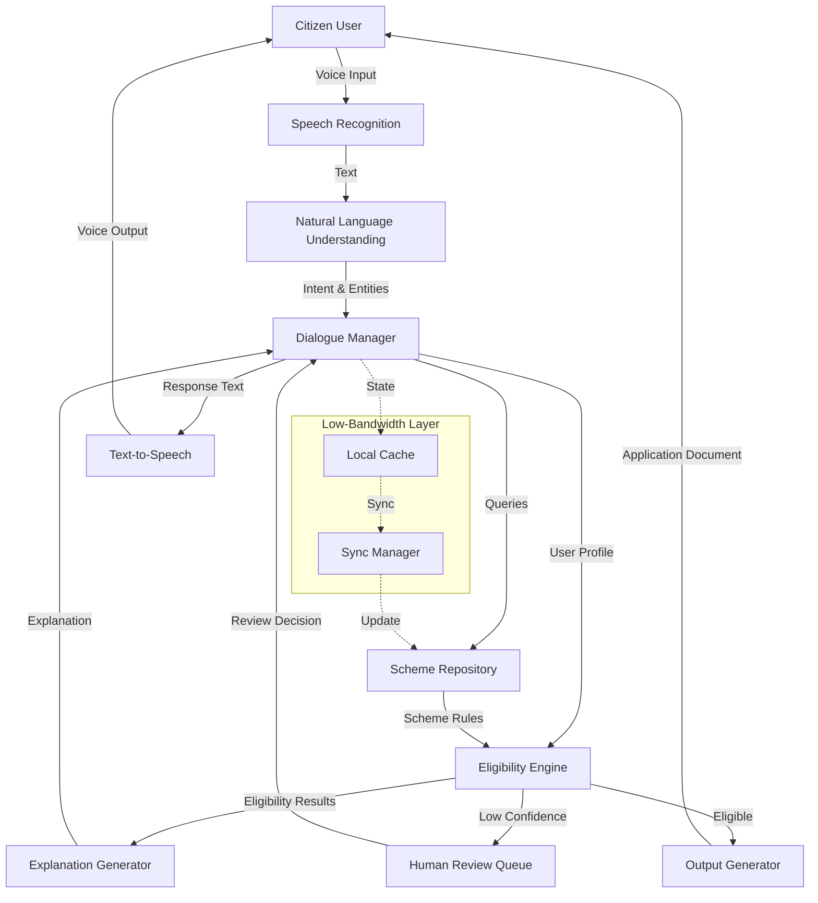

# Design Document: JanMitra AI Platform

## Overview

The JanMitra AI Platform is a voice-first conversational AI system designed to democratize access to government welfare schemes for rural and low-literacy citizens in India. The system architecture follows a modular, pipeline-based approach where speech input flows through processing stages: speech-to-text conversion, conversational dialogue management, eligibility reasoning, explanation generation, and structured output creation.

The platform is built on three core principles:
1. **Voice-First Design**: All interactions prioritize speech over text, with natural language understanding optimized for Indian regional languages
2. **Explainable AI**: Every eligibility decision includes clear reasoning that citizens can understand
3. **Resilient Operation**: The system functions reliably in low-bandwidth, intermittent connectivity environments

Key design decisions:
- **Stateful conversation management** to handle multi-turn dialogues with context preservation
- **Rule-based eligibility engine** (not pure ML) to ensure deterministic, auditable decisions
- **Hybrid confidence scoring** combining rule match certainty with input data quality
- **Progressive data sync** for offline-first operation with eventual consistency
- **Human-in-the-loop integration** as a first-class system component, not an afterthought

## Architecture

### System Architecture



### Component Architecture

The system is organized into six primary subsystems:

1. **Speech Processing Layer**: Handles bidirectional speech conversion (ASR/TTS) with language-specific models
2. **Conversation Layer**: Manages dialogue state, intent recognition, and information extraction
3. **Knowledge Layer**: Maintains verified scheme rules, eligibility criteria, and application templates
4. **Reasoning Layer**: Performs eligibility determination with confidence scoring
5. **Explanation Layer**: Generates human-understandable decision explanations
6. **Output Layer**: Creates structured, application-ready documents

### Data Flow

1. **Input Phase**: Voice → ASR → Text → NLU → Structured Intent
2. **Dialogue Phase**: Intent → Dialogue Manager → Information Collection → User Profile
3. **Reasoning Phase**: User Profile + Scheme Rules → Eligibility Engine → Eligibility Results + Confidence
4. **Explanation Phase**: Eligibility Results → Explanation Generator → Natural Language Explanation
5. **Output Phase**: Eligibility Results → Output Generator → Application Documents

## Components and Interfaces

### 1. Speech Processor

**Responsibilities:**
- Convert speech to text (ASR) in 10+ Indian regional languages
- Convert text to speech (TTS) with natural prosody
- Handle noise filtering and audio preprocessing
- Adapt audio quality based on bandwidth availability

**Interfaces:**

```typescript
interface SpeechProcessor {
  // Convert speech audio to text
  speechToText(audio: AudioBuffer, language: LanguageCode): Promise<TranscriptionResult>
  
  // Convert text to speech audio
  textToSpeech(text: string, language: LanguageCode, quality: AudioQuality): Promise<AudioBuffer>
  
  // Detect language from audio sample
  detectLanguage(audio: AudioBuffer): Promise<LanguageCode>
  
  // Apply noise filtering
  filterNoise(audio: AudioBuffer): AudioBuffer
}

interface TranscriptionResult {
  text: string
  confidence: number  // 0-100
  language: LanguageCode
  alternates?: string[]  // Alternative transcriptions
}

enum AudioQuality {
  HIGH = "high",        // Full quality for good bandwidth
  MEDIUM = "medium",    // Balanced quality
  LOW = "low"          // Compressed for low bandwidth
}

type LanguageCode = "hi" | "bn" | "ta" | "te" | "mr" | "gu" | "kn" | "ml" | "pa" | "or"
```

**Key Algorithms:**
- **Noise Reduction**: Spectral subtraction with adaptive thresholding
- **Language Detection**: Acoustic model scoring across language models
- **Bandwidth Adaptation**: Dynamic bitrate adjustment (8-64 kbps) based on network conditions

### 2. Conversation Manager

**Responsibilities:**
- Manage multi-turn dialogue state
- Extract structured information from natural language
- Ask clarifying questions when information is incomplete
- Adapt conversation complexity to user comprehension level
- Handle conversation interruptions and resumption

**Interfaces:**

```typescript
interface ConversationManager {
  // Start a new conversation session
  startConversation(userId: string, language: LanguageCode): ConversationSession
  
  // Process user utterance and generate response
  processUtterance(sessionId: string, utterance: string): Promise<ConversationResponse>
  
  // Get current conversation state
  getState(sessionId: string): ConversationState
  
  // Resume a saved conversation
  resumeConversation(sessionId: string): ConversationSession
  
  // Save conversation state for offline mode
  saveState(sessionId: string): Promise<void>
}

interface ConversationSession {
  sessionId: string
  userId: string
  language: LanguageCode
  startTime: Date
  state: ConversationState
}

interface ConversationState {
  phase: ConversationPhase
  collectedInfo: UserProfile
  currentQuestion: Question | null
  conversationHistory: Turn[]
  comprehensionLevel: number  // 1-5, adaptive
}

enum ConversationPhase {
  GREETING = "greeting",
  INFO_COLLECTION = "info_collection",
  CONFIRMATION = "confirmation",
  ELIGIBILITY_CHECK = "eligibility_check",
  EXPLANATION = "explanation",
  OUTPUT_GENERATION = "output_generation",
  COMPLETE = "complete"
}

interface ConversationResponse {
  text: string
  phase: ConversationPhase
  requiresInput: boolean
  suggestions?: string[]  // Suggested responses for user
}

interface Turn {
  speaker: "user" | "system"
  text: string
  timestamp: Date
}
```

**Key Algorithms:**
- **Intent Classification**: Multi-class classifier for user intents (provide_info, ask_question, confirm, deny, request_help)
- **Entity Extraction**: Named entity recognition for personal details (name, age, income, location, family size, etc.)
- **Dialogue Policy**: Rule-based state machine with fallback to clarification questions
- **Comprehension Adaptation**: Adjust question complexity based on user response patterns

### 3. Scheme Repository

**Responsibilities:**
- Store verified government welfare scheme information
- Maintain scheme eligibility rules and criteria
- Track scheme versions for audit purposes
- Provide fast lookup of applicable schemes

**Interfaces:**

```typescript
interface SchemeRepository {
  // Get all active schemes
  getAllSchemes(): Promise<Scheme[]>
  
  // Get schemes applicable to user profile
  getApplicableSchemes(profile: UserProfile): Promise<Scheme[]>
  
  // Get specific scheme by ID
  getScheme(schemeId: string): Promise<Scheme>
  
  // Get scheme rules for eligibility checking
  getSchemeRules(schemeId: string): Promise<EligibilityRules>
  
  // Update scheme information (admin only)
  updateScheme(scheme: Scheme): Promise<void>
}

interface Scheme {
  schemeId: string
  name: string
  nameTranslations: Record<LanguageCode, string>
  description: string
  descriptionTranslations: Record<LanguageCode, string>
  benefits: string[]
  benefitTranslations: Record<LanguageCode, string[]>
  eligibilityRules: EligibilityRules
  applicationTemplate: ApplicationTemplate
  version: number
  lastUpdated: Date
  isActive: boolean
}

interface EligibilityRules {
  schemeId: string
  criteria: Criterion[]
  requiredDocuments: string[]
  exclusionRules: ExclusionRule[]
}

interface Criterion {
  field: string  // e.g., "age", "income", "location"
  operator: ComparisonOperator
  value: any
  weight: number  // For confidence scoring
  description: string
  descriptionTranslations: Record<LanguageCode, string>
}

enum ComparisonOperator {
  EQUALS = "equals",
  NOT_EQUALS = "not_equals",
  GREATER_THAN = "greater_than",
  LESS_THAN = "less_than",
  GREATER_THAN_OR_EQUAL = "greater_than_or_equal",
  LESS_THAN_OR_EQUAL = "less_than_or_equal",
  IN = "in",
  NOT_IN = "not_in",
  CONTAINS = "contains"
}

interface ExclusionRule {
  condition: string
  reason: string
  reasonTranslations: Record<LanguageCode, string>
}
```

### 4. Eligibility Engine

**Responsibilities:**
- Evaluate user profiles against scheme eligibility criteria
- Calculate confidence scores for determinations
- Identify all eligible schemes
- Identify reasons for ineligibility
- Flag low-confidence cases for human review

**Interfaces:**

```typescript
interface EligibilityEngine {
  // Determine eligibility for all schemes
  determineEligibility(profile: UserProfile): Promise<EligibilityResult[]>
  
  // Determine eligibility for specific scheme
  checkSchemeEligibility(profile: UserProfile, schemeId: string): Promise<EligibilityResult>
  
  // Calculate confidence score
  calculateConfidence(profile: UserProfile, rules: EligibilityRules): number
}

interface EligibilityResult {
  schemeId: string
  schemeName: string
  isEligible: boolean
  confidence: number  // 0-100
  matchedCriteria: CriterionMatch[]
  unmatchedCriteria: CriterionMatch[]
  requiresHumanReview: boolean
  reasoning: string[]
}

interface CriterionMatch {
  criterion: Criterion
  userValue: any
  matches: boolean
  certainty: number  // How certain we are about the user value
}

interface UserProfile {
  userId: string
  personalInfo: PersonalInfo
  economicInfo: EconomicInfo
  locationInfo: LocationInfo
  familyInfo: FamilyInfo
  additionalInfo: Record<string, any>
  dataQuality: DataQualityMetrics
}

interface PersonalInfo {
  name: string
  age?: number
  gender?: string
  category?: string  // SC/ST/OBC/General
  disability?: boolean
}

interface EconomicInfo {
  annualIncome?: number
  employmentStatus?: string
  occupation?: string
  hasBPLCard?: boolean
  hasRationCard?: boolean
  rationCardType?: string
}

interface LocationInfo {
  state: string
  district?: string
  block?: string
  village?: string
  isRural: boolean
}

interface FamilyInfo {
  familySize?: number
  dependents?: number
  hasWidow?: boolean
  hasOrphan?: boolean
}

interface DataQualityMetrics {
  completeness: number  // 0-100, percentage of fields filled
  certainty: number     // 0-100, confidence in extracted values
  missingCriticalFields: string[]
}
```

**Key Algorithms:**

**Eligibility Determination Algorithm:**
```
function determineEligibility(profile, rules):
  matchedCriteria = []
  unmatchedCriteria = []
  
  for each criterion in rules.criteria:
    userValue = profile[criterion.field]
    
    if userValue is missing:
      unmatchedCriteria.add({criterion, userValue: null, matches: false, certainty: 0})
      continue
    
    matches = evaluateCriterion(criterion, userValue)
    certainty = profile.dataQuality.fieldCertainty[criterion.field]
    
    if matches:
      matchedCriteria.add({criterion, userValue, matches: true, certainty})
    else:
      unmatchedCriteria.add({criterion, userValue, matches: false, certainty})
  
  // Check exclusion rules
  for each exclusion in rules.exclusionRules:
    if evaluateExclusion(exclusion, profile):
      return {isEligible: false, reason: exclusion.reason, confidence: 100}
  
  // Determine eligibility
  isEligible = (unmatchedCriteria.length == 0)
  confidence = calculateConfidence(matchedCriteria, unmatchedCriteria, profile.dataQuality)
  
  return {isEligible, confidence, matchedCriteria, unmatchedCriteria}
```

**Confidence Scoring Algorithm:**
```
function calculateConfidence(matched, unmatched, dataQuality):
  if unmatched.length > 0:
    return 0  // Not eligible, but we're certain about it
  
  // Weighted average of criterion certainties
  totalWeight = sum(criterion.weight for criterion in matched)
  weightedCertainty = sum(match.certainty * match.criterion.weight for match in matched)
  
  criterionConfidence = weightedCertainty / totalWeight
  
  // Factor in overall data quality
  overallConfidence = (criterionConfidence * 0.7) + (dataQuality.completeness * 0.2) + (dataQuality.certainty * 0.1)
  
  return overallConfidence
```

### 5. Explanation Generator

**Responsibilities:**
- Generate clear, simple explanations of eligibility decisions
- Translate explanations to user's language
- Provide actionable guidance for near-miss cases
- Avoid technical jargon and legal terminology

**Interfaces:**

```typescript
interface ExplanationGenerator {
  // Generate explanation for eligibility result
  generateExplanation(result: EligibilityResult, language: LanguageCode): Promise<Explanation>
  
  // Generate comparison explanation for multiple schemes
  generateComparison(results: EligibilityResult[], language: LanguageCode): Promise<string>
}

interface Explanation {
  summary: string  // One-sentence summary
  details: string  // Detailed explanation
  matchedPoints: string[]  // Why user is eligible
  unmatchedPoints: string[]  // Why user is not eligible
  actionableGuidance?: string  // What user can do
  confidence: string  // Human-readable confidence level
}
```

**Key Algorithms:**

**Explanation Generation Template:**
```
For Eligible:
  "आप [scheme name] के लिए पात्र हैं क्योंकि:
   - [matched criterion 1 explanation]
   - [matched criterion 2 explanation]
   - ...
   
   आप इस योजना के लिए आवेदन कर सकते हैं।"

For Not Eligible:
  "आप [scheme name] के लिए पात्र नहीं हैं क्योंकि:
   - [unmatched criterion 1 explanation]
   - [unmatched criterion 2 explanation]
   - ...
   
   [Actionable guidance if applicable]"

For Near-Miss:
  "आप [scheme name] के लिए लगभग पात्र हैं। आपको केवल [missing requirement] की आवश्यकता है।"
```

### 6. Output Generator

**Responsibilities:**
- Create structured application documents
- Populate forms with collected information
- Generate unique application reference numbers
- Produce both digital and print-ready formats

**Interfaces:**

```typescript
interface OutputGenerator {
  // Generate application document
  generateApplication(profile: UserProfile, schemeId: string): Promise<ApplicationDocument>
  
  // Generate multiple applications
  generateMultipleApplications(profile: UserProfile, schemeIds: string[]): Promise<ApplicationDocument[]>
}

interface ApplicationDocument {
  applicationId: string  // Unique reference number
  schemeId: string
  schemeName: string
  applicantInfo: UserProfile
  generatedDate: Date
  digitalFormat: ApplicationData
  printFormat: PrintableDocument
  requiredDocuments: string[]
  submissionInstructions: string
}

interface ApplicationData {
  format: "json" | "xml"
  data: Record<string, any>
  schema: string  // Schema version
}

interface PrintableDocument {
  format: "pdf"
  content: Buffer
  pages: number
}

interface ApplicationTemplate {
  schemeId: string
  fields: TemplateField[]
  layout: string  // PDF layout template
  instructions: string
}

interface TemplateField {
  fieldId: string
  label: string
  labelTranslations: Record<LanguageCode, string>
  sourceField: string  // Maps to UserProfile field
  required: boolean
  format?: string  // Date format, number format, etc.
}
```

### 7. Human Review Queue

**Responsibilities:**
- Queue low-confidence cases for human review
- Provide reviewers with all context and AI reasoning
- Record human decisions and reasoning
- Track review metrics for system improvement

**Interfaces:**

```typescript
interface HumanReviewQueue {
  // Add case to review queue
  queueForReview(sessionId: string, result: EligibilityResult, profile: UserProfile): Promise<ReviewCase>
  
  // Get next case for review
  getNextCase(reviewerId: string): Promise<ReviewCase | null>
  
  // Submit review decision
  submitReview(caseId: string, decision: ReviewDecision): Promise<void>
  
  // Get review statistics
  getReviewStats(reviewerId?: string): Promise<ReviewStats>
}

interface ReviewCase {
  caseId: string
  sessionId: string
  profile: UserProfile
  eligibilityResults: EligibilityResult[]
  aiReasoning: string[]
  queuedAt: Date
  priority: number  // Based on urgency and confidence
}

interface ReviewDecision {
  caseId: string
  reviewerId: string
  decision: "approve" | "reject" | "modify"
  modifiedResults?: EligibilityResult[]
  reasoning: string
  reviewedAt: Date
}

interface ReviewStats {
  totalReviewed: number
  averageReviewTime: number
  agreementRate: number  // % of times reviewer agreed with AI
  overrideRate: number   // % of times reviewer overrode AI
}
```

### 8. Sync Manager (Low-Bandwidth Support)

**Responsibilities:**
- Cache conversation state locally
- Sync data when connectivity is available
- Handle offline operation
- Manage progressive data loading

**Interfaces:**

```typescript
interface SyncManager {
  // Save state locally
  saveLocal(sessionId: string, state: ConversationState): Promise<void>
  
  // Load state from local cache
  loadLocal(sessionId: string): Promise<ConversationState | null>
  
  // Sync with server when online
  sync(): Promise<SyncResult>
  
  // Check connectivity status
  getConnectivityStatus(): ConnectivityStatus
  
  // Register for connectivity changes
  onConnectivityChange(callback: (status: ConnectivityStatus) => void): void
}

interface SyncResult {
  success: boolean
  syncedSessions: string[]
  failedSessions: string[]
  errors: string[]
}

interface ConnectivityStatus {
  isOnline: boolean
  bandwidth: number  // kbps
  latency: number    // ms
  quality: "high" | "medium" | "low"
}
```

## Data Models

### Core Data Structures

**User Profile:**
```typescript
interface UserProfile {
  userId: string
  personalInfo: {
    name: string
    age?: number
    gender?: "male" | "female" | "other"
    category?: "general" | "obc" | "sc" | "st"
    disability?: boolean
    maritalStatus?: "single" | "married" | "widowed" | "divorced"
  }
  economicInfo: {
    annualIncome?: number
    employmentStatus?: "employed" | "unemployed" | "self_employed" | "retired"
    occupation?: string
    hasBPLCard?: boolean
    hasRationCard?: boolean
    rationCardType?: "apl" | "bpl" | "aay"
    landOwnership?: number  // in acres
  }
  locationInfo: {
    state: string
    district?: string
    block?: string
    village?: string
    pincode?: string
    isRural: boolean
  }
  familyInfo: {
    familySize?: number
    dependents?: number
    children?: number
    hasWidow?: boolean
    hasOrphan?: boolean
    hasSeniorCitizen?: boolean
  }
  documents: {
    aadhaar?: string
    panCard?: string
    rationCard?: string
    bankAccount?: string
  }
  dataQuality: {
    completeness: number
    certainty: number
    missingCriticalFields: string[]
    fieldCertainty: Record<string, number>
  }
  createdAt: Date
  updatedAt: Date
}
```

**Scheme Definition:**
```typescript
interface Scheme {
  schemeId: string
  name: string
  nameTranslations: Record<LanguageCode, string>
  category: "health" | "education" | "housing" | "employment" | "agriculture" | "pension" | "other"
  description: string
  descriptionTranslations: Record<LanguageCode, string>
  benefits: {
    type: "monetary" | "subsidy" | "service" | "goods"
    amount?: number
    description: string
    descriptionTranslations: Record<LanguageCode, string>
  }[]
  eligibilityRules: EligibilityRules
  applicationTemplate: ApplicationTemplate
  geographicScope: {
    level: "national" | "state" | "district"
    applicableStates?: string[]
    applicableDistricts?: string[]
  }
  targetBeneficiaries: string[]
  officialWebsite?: string
  helplineNumber?: string
  version: number
  lastUpdated: Date
  isActive: boolean
}
```

**Conversation State:**
```typescript
interface ConversationState {
  sessionId: string
  userId: string
  language: LanguageCode
  phase: ConversationPhase
  collectedInfo: Partial<UserProfile>
  currentQuestion: {
    field: string
    text: string
    attempts: number
    maxAttempts: number
  } | null
  conversationHistory: {
    speaker: "user" | "system"
    text: string
    timestamp: Date
    intent?: string
    entities?: Record<string, any>
  }[]
  comprehensionLevel: number  // 1-5
  clarificationNeeded: string[]
  confirmedFields: string[]
  startTime: Date
  lastActivityTime: Date
  isOffline: boolean
}
```

### Database Schema

**Schemes Table:**
```sql
CREATE TABLE schemes (
  scheme_id VARCHAR(50) PRIMARY KEY,
  name VARCHAR(200) NOT NULL,
  category VARCHAR(50) NOT NULL,
  description TEXT,
  benefits JSONB,
  eligibility_rules JSONB NOT NULL,
  application_template JSONB NOT NULL,
  geographic_scope JSONB,
  target_beneficiaries TEXT[],
  official_website VARCHAR(500),
  helpline_number VARCHAR(20),
  version INTEGER NOT NULL DEFAULT 1,
  last_updated TIMESTAMP NOT NULL DEFAULT NOW(),
  is_active BOOLEAN NOT NULL DEFAULT true,
  created_at TIMESTAMP NOT NULL DEFAULT NOW()
);

CREATE INDEX idx_schemes_category ON schemes(category);
CREATE INDEX idx_schemes_active ON schemes(is_active);
```

**Conversations Table:**
```sql
CREATE TABLE conversations (
  session_id VARCHAR(50) PRIMARY KEY,
  user_id VARCHAR(50) NOT NULL,
  language VARCHAR(5) NOT NULL,
  phase VARCHAR(50) NOT NULL,
  state JSONB NOT NULL,
  start_time TIMESTAMP NOT NULL,
  last_activity_time TIMESTAMP NOT NULL,
  completed BOOLEAN NOT NULL DEFAULT false,
  created_at TIMESTAMP NOT NULL DEFAULT NOW(),
  updated_at TIMESTAMP NOT NULL DEFAULT NOW()
);

CREATE INDEX idx_conversations_user ON conversations(user_id);
CREATE INDEX idx_conversations_phase ON conversations(phase);
```

**Applications Table:**
```sql
CREATE TABLE applications (
  application_id VARCHAR(50) PRIMARY KEY,
  session_id VARCHAR(50) REFERENCES conversations(session_id),
  user_id VARCHAR(50) NOT NULL,
  scheme_id VARCHAR(50) REFERENCES schemes(scheme_id),
  profile JSONB NOT NULL,
  eligibility_result JSONB NOT NULL,
  document_data JSONB NOT NULL,
  status VARCHAR(50) NOT NULL DEFAULT 'generated',
  generated_at TIMESTAMP NOT NULL DEFAULT NOW(),
  submitted_at TIMESTAMP,
  created_at TIMESTAMP NOT NULL DEFAULT NOW()
);

CREATE INDEX idx_applications_user ON applications(user_id);
CREATE INDEX idx_applications_scheme ON applications(scheme_id);
CREATE INDEX idx_applications_status ON applications(status);
```

**Review Cases Table:**
```sql
CREATE TABLE review_cases (
  case_id VARCHAR(50) PRIMARY KEY,
  session_id VARCHAR(50) REFERENCES conversations(session_id),
  profile JSONB NOT NULL,
  eligibility_results JSONB NOT NULL,
  ai_reasoning JSONB NOT NULL,
  priority INTEGER NOT NULL DEFAULT 0,
  status VARCHAR(50) NOT NULL DEFAULT 'pending',
  queued_at TIMESTAMP NOT NULL DEFAULT NOW(),
  reviewed_at TIMESTAMP,
  reviewer_id VARCHAR(50),
  decision JSONB,
  created_at TIMESTAMP NOT NULL DEFAULT NOW()
);

CREATE INDEX idx_review_cases_status ON review_cases(status);
CREATE INDEX idx_review_cases_priority ON review_cases(priority DESC);
CREATE INDEX idx_review_cases_reviewer ON review_cases(reviewer_id);
```

**Audit Log Table:**
```sql
CREATE TABLE audit_log (
  log_id SERIAL PRIMARY KEY,
  event_type VARCHAR(50) NOT NULL,
  user_id VARCHAR(50),
  session_id VARCHAR(50),
  scheme_id VARCHAR(50),
  event_data JSONB,
  timestamp TIMESTAMP NOT NULL DEFAULT NOW()
);

CREATE INDEX idx_audit_log_type ON audit_log(event_type);
CREATE INDEX idx_audit_log_user ON audit_log(user_id);
CREATE INDEX idx_audit_log_timestamp ON audit_log(timestamp);
```


## Correctness Properties

*A property is a characteristic or behavior that should hold true across all valid executions of a system—essentially, a formal statement about what the system should do. Properties serve as the bridge between human-readable specifications and machine-verifiable correctness guarantees.*

### Property Reflection

After analyzing all acceptance criteria, I identified several redundant properties:
- Criteria 4.3 and 6.1 both require confidence score generation (consolidated into Property 8)
- Criteria 1.4, 8.2, and 10.5 all relate to low-bandwidth audio compression (consolidated into Property 4)
- Criteria 4.4 and 9.1 both require flagging low-confidence cases (consolidated into Property 11)
- Criteria 4.5 and 12.1 both require returning all eligible schemes (consolidated into Property 10)

The following properties represent the unique, non-redundant correctness requirements:

### Speech Processing Properties

**Property 1: Speech Recognition Accuracy**
*For any* audio sample in a supported language, when the Speech_Processor transcribes it, the transcription accuracy SHALL be at least 85%.
**Validates: Requirements 1.1**

**Property 2: Noise Filtering**
*For any* audio sample with background noise, the Speech_Processor SHALL produce a transcription without failing.
**Validates: Requirements 1.2**

**Property 3: Low Confidence Handling**
*For any* speech input with transcription confidence below 70%, the Speech_Processor SHALL request the user to repeat the input.
**Validates: Requirements 1.3**

**Property 4: Low-Bandwidth Audio Compression**
*For any* audio data in Low_Bandwidth_Mode, the compressed audio size SHALL be within the bandwidth constraints (≤ 50 kbps bitrate).
**Validates: Requirements 1.4, 8.2, 10.5**

**Property 5: Text-to-Speech Generation**
*For any* text response, the Speech_Processor SHALL generate audio output in the specified language.
**Validates: Requirements 10.1**

**Property 6: Language Consistency**
*For any* conversation session, the output speech language SHALL match the input speech language detected at session start.
**Validates: Requirements 10.2**

**Property 7: Audio Replay Idempotence**
*For any* response, replaying the audio SHALL produce the same audio content.
**Validates: Requirements 10.4**

### Conversation Management Properties

**Property 8: Single Question Per Turn**
*For any* conversation turn during information collection, the Conversation_Manager SHALL ask exactly one question.
**Validates: Requirements 2.2**

**Property 9: Response Acknowledgment**
*For any* user response, the Conversation_Manager SHALL include an acknowledgment in the next system turn.
**Validates: Requirements 2.3**

**Property 10: Clarification for Incomplete Information**
*For any* user response that is incomplete or ambiguous (confidence < 80%), the Conversation_Manager SHALL ask a clarifying question.
**Validates: Requirements 2.4**

**Property 11: Confirmation After Collection**
*For any* conversation where all required fields are collected, the Conversation_Manager SHALL generate a summary and request confirmation before proceeding to eligibility check.
**Validates: Requirements 2.5**

### Scheme Repository Properties

**Property 12: Repository-Only Data Source**
*For any* eligibility determination, the Eligibility_Engine SHALL retrieve scheme rules exclusively from the Scheme_Repository (no external or cached sources).
**Validates: Requirements 3.1**

**Property 13: Version History Maintenance**
*For any* scheme update, the Scheme_Repository SHALL create a new version entry while preserving all previous versions.
**Validates: Requirements 3.3**

**Property 14: Active Scheme Enforcement**
*For any* eligibility check, only schemes marked as active and verified SHALL be considered.
**Validates: Requirements 3.4**

**Property 15: Version Logging**
*For any* eligibility determination, the system SHALL log the exact scheme version used in the audit log.
**Validates: Requirements 3.5**

### Eligibility Engine Properties

**Property 16: Comprehensive Criteria Evaluation**
*For any* user profile and scheme, the Eligibility_Engine SHALL evaluate the profile against all criteria defined in the scheme's eligibility rules.
**Validates: Requirements 4.1**

**Property 17: Deterministic Eligibility**
*For any* user profile and scheme, running eligibility determination multiple times SHALL produce identical results (same eligibility decision, same confidence score, same matched/unmatched criteria).
**Validates: Requirements 4.2**

**Property 18: Confidence Score Generation**
*For any* eligibility determination, the result SHALL include a Confidence_Score in the range [0, 100].
**Validates: Requirements 4.3, 6.1, 6.2**

**Property 19: Low Confidence Flagging**
*For any* eligibility result with Confidence_Score < 70, the system SHALL create a review case in the Human Review Queue.
**Validates: Requirements 4.4, 9.1**

**Property 20: Complete Eligible Scheme Identification**
*For any* user profile, the Eligibility_Engine SHALL return all schemes for which the profile meets all eligibility criteria.
**Validates: Requirements 4.5, 12.1**

**Property 21: Ineligibility Reasoning**
*For any* scheme where the user is not eligible, the result SHALL include the specific criteria that were not met.
**Validates: Requirements 4.6**

**Property 22: Uncertainty Reflection in Confidence**
*For any* two eligibility determinations where one has more missing or uncertain data fields, the one with more uncertainty SHALL have a lower or equal Confidence_Score.
**Validates: Requirements 6.3**

### Explanation Generation Properties

**Property 23: Language-Matched Explanations**
*For any* eligibility result, the generated explanation SHALL be in the same language as the user's conversation language.
**Validates: Requirements 5.1**

**Property 24: Eligible Explanation Content**
*For any* eligible result, the explanation SHALL mention all matched criteria from the eligibility result.
**Validates: Requirements 5.2**

**Property 25: Ineligible Explanation Content**
*For any* ineligible result, the explanation SHALL mention all unmatched criteria from the eligibility result.
**Validates: Requirements 5.3**

**Property 26: Near-Miss Actionable Guidance**
*For any* eligibility result where the user is ineligible but matches at least 80% of criteria, the explanation SHALL include actionable guidance.
**Validates: Requirements 5.6**

**Property 27: Confidence Communication**
*For any* eligibility result presented to users, the confidence level SHALL be communicated in understandable terms (e.g., "certain", "likely", "uncertain") rather than numeric scores.
**Validates: Requirements 6.5**

### Output Generation Properties

**Property 28: Document Generation for Eligible**
*For any* user profile determined eligible for a scheme, the Output_Generator SHALL create an ApplicationDocument.
**Validates: Requirements 7.1**

**Property 29: Complete Field Population**
*For any* generated application document, all required fields in the scheme's application template SHALL be populated with values from the user profile.
**Validates: Requirements 7.2**

**Property 30: Template Format Compliance**
*For any* generated application document, the structure SHALL match the scheme's ApplicationTemplate field definitions.
**Validates: Requirements 7.3**

**Property 31: Document Completeness**
*For any* generated application document, all required sections (applicant info, scheme details, declarations, required documents list) SHALL be present.
**Validates: Requirements 7.4**

**Property 32: Dual Format Generation**
*For any* application document, both digitalFormat and printFormat SHALL be generated.
**Validates: Requirements 7.5**

**Property 33: Unique Application IDs**
*For any* set of generated application documents, all applicationId values SHALL be unique.
**Validates: Requirements 7.6**

### Low-Bandwidth Properties

**Property 34: Data Compression in Low-Bandwidth Mode**
*For any* data transmission in Low_Bandwidth_Mode, the transmitted data size SHALL be smaller than the same transmission in normal mode.
**Validates: Requirements 8.1**

**Property 35: Offline State Persistence**
*For any* conversation session, when network connectivity is lost, the conversation state SHALL be saved to local storage.
**Validates: Requirements 8.3**

**Property 36: State Restoration Round-Trip**
*For any* conversation session that is saved locally and then restored, the restored state SHALL be equivalent to the state before disconnection.
**Validates: Requirements 8.4**

**Property 37: Essential Data Prioritization**
*For any* data transmission in Low_Bandwidth_Mode, essential data (user profile, eligibility results) SHALL be transmitted before optional data (audio quality enhancements, detailed logs).
**Validates: Requirements 8.6**

### Human Review Properties

**Property 38: Review Case Completeness**
*For any* case flagged for human review, the ReviewCase SHALL include the user profile, all eligibility results, and AI reasoning.
**Validates: Requirements 9.2**

**Property 39: Review Decision Recording**
*For any* human review decision, the system SHALL persist the ReviewDecision with decision type, reasoning, and timestamp.
**Validates: Requirements 9.3**

**Property 40: Override with Justification**
*For any* human review that overrides the AI decision, the ReviewDecision SHALL include a non-empty reasoning field.
**Validates: Requirements 9.4**

**Property 41: Manual Escalation**
*For any* user request for human assistance, the system SHALL create a ReviewCase in the Human Review Queue.
**Validates: Requirements 9.5**

### Privacy and Security Properties

**Property 42: Data Encryption**
*For any* personal information stored or transmitted, the data SHALL be encrypted (AES-256 for storage, TLS 1.3 for transit).
**Validates: Requirements 11.1**

**Property 43: Data Retention Compliance**
*For any* conversation session that is completed or abandoned, the temporary conversation data SHALL be deleted within 30 days.
**Validates: Requirements 11.2, 11.3**

**Property 44: Data Deletion on Request**
*For any* user data deletion request, all personal information associated with the user SHALL be removed from the system within 7 days.
**Validates: Requirements 11.5**

**Property 45: Access Audit Logging**
*For any* access to personal data, an audit log entry SHALL be created with timestamp, accessor identity, and data accessed.
**Validates: Requirements 11.6**

### Multi-Scheme Properties

**Property 46: Benefit Explanation Inclusion**
*For any* eligible scheme in a multi-scheme result, the explanation SHALL include the scheme's benefits.
**Validates: Requirements 12.2**

**Property 47: Overlap Restriction Explanation**
*For any* set of eligible schemes with overlapping benefits, the explanation SHALL include information about simultaneous enrollment restrictions.
**Validates: Requirements 12.4**

**Property 48: Needs-Based Prioritization**
*For any* user profile with stated needs and multiple eligible schemes, the schemes SHALL be ranked with higher priority given to schemes matching the stated needs.
**Validates: Requirements 12.5**

## Error Handling

### Error Categories

The system must handle four categories of errors:

1. **Input Errors**: Speech recognition failures, unclear audio, unsupported languages
2. **Data Errors**: Missing required information, invalid data formats, incomplete profiles
3. **System Errors**: Database failures, network timeouts, service unavailability
4. **Business Logic Errors**: No eligible schemes, conflicting criteria, ambiguous rules

### Error Handling Strategies

**Speech Recognition Errors:**
```typescript
try {
  const result = await speechProcessor.speechToText(audio, language)
  if (result.confidence < 70) {
    return {
      type: "clarification_needed",
      message: "I couldn't understand that clearly. Could you please repeat?"
    }
  }
} catch (error) {
  if (error instanceof UnsupportedLanguageError) {
    return {
      type: "unsupported_language",
      message: "I'm sorry, I don't support that language yet."
    }
  }
  // Log error and fallback to human assistance
  await queueForHumanReview(sessionId, "speech_recognition_failure")
}
```

**Data Validation Errors:**
```typescript
function validateUserProfile(profile: UserProfile): ValidationResult {
  const errors: string[] = []
  const warnings: string[] = []
  
  // Check required fields
  if (!profile.personalInfo.name) {
    errors.push("Name is required")
  }
  if (!profile.locationInfo.state) {
    errors.push("State is required")
  }
  
  // Check data quality
  if (profile.dataQuality.completeness < 60) {
    warnings.push("Profile is incomplete, may affect eligibility determination")
  }
  
  return {
    isValid: errors.length === 0,
    errors,
    warnings
  }
}
```

**Network and System Errors:**
```typescript
async function handleNetworkError(error: NetworkError, operation: string) {
  // Save state locally
  await syncManager.saveLocal(sessionId, conversationState)
  
  // Notify user
  await notifyUser({
    type: "network_error",
    message: "Connection lost. Your progress has been saved and will resume when connection is restored.",
    canContinueOffline: true
  })
  
  // Log for monitoring
  logger.error("Network error during operation", {
    operation,
    error: error.message,
    sessionId,
    timestamp: new Date()
  })
}
```

**Eligibility Determination Errors:**
```typescript
async function handleEligibilityError(profile: UserProfile, error: Error) {
  if (error instanceof InsufficientDataError) {
    // Identify missing fields and ask for them
    const missingFields = error.missingFields
    await conversationManager.askForMissingFields(sessionId, missingFields)
  } else if (error instanceof AmbiguousRulesError) {
    // Flag for human review
    await humanReviewQueue.queueForReview(sessionId, {
      reason: "ambiguous_rules",
      profile,
      error: error.message
    })
  } else {
    // Unexpected error - log and escalate
    logger.error("Unexpected eligibility error", { error, profile })
    await humanReviewQueue.queueForReview(sessionId, {
      reason: "system_error",
      profile,
      error: error.message
    })
  }
}
```

### Graceful Degradation

When components fail, the system degrades gracefully:

1. **Speech Recognition Failure** → Fall back to text input if available, or queue for human assistance
2. **Low Confidence Eligibility** → Flag for human review rather than providing incorrect information
3. **Network Failure** → Continue in offline mode with local state, sync when reconnected
4. **Database Failure** → Use cached scheme data if available and recent (< 24 hours old)
5. **TTS Failure** → Display text response as fallback

### Error Recovery

**Automatic Retry Logic:**
```typescript
async function retryWithBackoff<T>(
  operation: () => Promise<T>,
  maxRetries: number = 3,
  baseDelay: number = 1000
): Promise<T> {
  for (let attempt = 0; attempt < maxRetries; attempt++) {
    try {
      return await operation()
    } catch (error) {
      if (attempt === maxRetries - 1) throw error
      
      const delay = baseDelay * Math.pow(2, attempt)
      await sleep(delay)
    }
  }
  throw new Error("Max retries exceeded")
}
```

**State Recovery:**
```typescript
async function recoverConversationState(sessionId: string): Promise<ConversationState> {
  // Try to load from cache first
  const cachedState = await syncManager.loadLocal(sessionId)
  if (cachedState) {
    return cachedState
  }
  
  // Try to load from database
  try {
    const dbState = await database.getConversationState(sessionId)
    return dbState
  } catch (error) {
    // If all else fails, start fresh but log the issue
    logger.error("Failed to recover conversation state", { sessionId, error })
    return createNewConversationState(sessionId)
  }
}
```

## Testing Strategy

### Dual Testing Approach

The JanMitra AI Platform requires both unit testing and property-based testing for comprehensive coverage:

- **Unit tests** verify specific examples, edge cases, and error conditions
- **Property tests** verify universal properties across all inputs
- Both are complementary and necessary for ensuring system correctness

### Property-Based Testing

We will use **fast-check** (for TypeScript/JavaScript components) as our property-based testing library. Each property test will:

- Run a minimum of 100 iterations with randomly generated inputs
- Reference the specific design document property being tested
- Use the tag format: `Feature: janmitra-ai-platform, Property {number}: {property_text}`

**Example Property Test Structure:**
```typescript
import fc from 'fast-check'

// Feature: janmitra-ai-platform, Property 17: Deterministic Eligibility
describe('Eligibility Engine - Deterministic Eligibility', () => {
  it('should produce identical results for the same profile and scheme', async () => {
    await fc.assert(
      fc.asyncProperty(
        userProfileArbitrary(),
        schemeArbitrary(),
        async (profile, scheme) => {
          const result1 = await eligibilityEngine.checkSchemeEligibility(profile, scheme.schemeId)
          const result2 = await eligibilityEngine.checkSchemeEligibility(profile, scheme.schemeId)
          
          expect(result1.isEligible).toBe(result2.isEligible)
          expect(result1.confidence).toBe(result2.confidence)
          expect(result1.matchedCriteria).toEqual(result2.matchedCriteria)
          expect(result1.unmatchedCriteria).toEqual(result2.unmatchedCriteria)
        }
      ),
      { numRuns: 100 }
    )
  })
})
```

### Unit Testing Strategy

Unit tests should focus on:

1. **Specific Examples**: Concrete test cases that demonstrate correct behavior
2. **Edge Cases**: Boundary conditions, empty inputs, maximum values
3. **Error Conditions**: Invalid inputs, system failures, timeout scenarios
4. **Integration Points**: Component interactions, API contracts

**Example Unit Test Structure:**
```typescript
describe('Conversation Manager', () => {
  describe('startConversation', () => {
    it('should greet user in Hindi', async () => {
      const session = conversationManager.startConversation('user123', 'hi')
      const response = await conversationManager.processUtterance(session.sessionId, '')
      
      expect(response.text).toContain('नमस्ते')
      expect(response.phase).toBe(ConversationPhase.GREETING)
    })
    
    it('should handle empty user ID', async () => {
      await expect(
        conversationManager.startConversation('', 'hi')
      ).rejects.toThrow('User ID is required')
    })
  })
})
```

### Test Data Generators

For property-based testing, we need generators (arbitraries) for our domain objects:

```typescript
// User Profile Generator
function userProfileArbitrary(): fc.Arbitrary<UserProfile> {
  return fc.record({
    userId: fc.uuid(),
    personalInfo: fc.record({
      name: fc.fullName(),
      age: fc.option(fc.integer({ min: 18, max: 100 })),
      gender: fc.option(fc.constantFrom('male', 'female', 'other')),
      category: fc.option(fc.constantFrom('general', 'obc', 'sc', 'st')),
      disability: fc.option(fc.boolean())
    }),
    economicInfo: fc.record({
      annualIncome: fc.option(fc.integer({ min: 0, max: 10000000 })),
      employmentStatus: fc.option(fc.constantFrom('employed', 'unemployed', 'self_employed', 'retired')),
      hasBPLCard: fc.option(fc.boolean()),
      hasRationCard: fc.option(fc.boolean())
    }),
    locationInfo: fc.record({
      state: fc.constantFrom('Maharashtra', 'Karnataka', 'Tamil Nadu', 'West Bengal', 'Uttar Pradesh'),
      district: fc.option(fc.string()),
      isRural: fc.boolean()
    }),
    familyInfo: fc.record({
      familySize: fc.option(fc.integer({ min: 1, max: 15 })),
      dependents: fc.option(fc.integer({ min: 0, max: 10 }))
    }),
    dataQuality: fc.record({
      completeness: fc.integer({ min: 0, max: 100 }),
      certainty: fc.integer({ min: 0, max: 100 }),
      missingCriticalFields: fc.array(fc.string())
    })
  })
}

// Scheme Generator
function schemeArbitrary(): fc.Arbitrary<Scheme> {
  return fc.record({
    schemeId: fc.uuid(),
    name: fc.string(),
    category: fc.constantFrom('health', 'education', 'housing', 'employment', 'agriculture', 'pension'),
    eligibilityRules: eligibilityRulesArbitrary(),
    isActive: fc.boolean(),
    version: fc.integer({ min: 1, max: 100 })
  })
}

// Eligibility Rules Generator
function eligibilityRulesArbitrary(): fc.Arbitrary<EligibilityRules> {
  return fc.record({
    schemeId: fc.uuid(),
    criteria: fc.array(criterionArbitrary(), { minLength: 1, maxLength: 10 }),
    requiredDocuments: fc.array(fc.string()),
    exclusionRules: fc.array(exclusionRuleArbitrary())
  })
}
```

### Integration Testing

Integration tests verify that components work together correctly:

1. **End-to-End Conversation Flow**: Test complete user journey from greeting to application generation
2. **Speech Pipeline**: Test ASR → NLU → Dialogue → TTS flow
3. **Eligibility Pipeline**: Test Profile → Repository → Engine → Explanation flow
4. **Offline/Online Sync**: Test state persistence and restoration
5. **Human Review Workflow**: Test case flagging, review, and decision recording

### Performance Testing

While not part of unit/property tests, performance testing is critical:

1. **Speech Processing Latency**: ASR and TTS should complete within 2 seconds
2. **Eligibility Determination**: Should complete within 1 second for profiles with < 20 schemes
3. **Low-Bandwidth Operation**: System should function at 50 kbps with acceptable latency (< 5 seconds per turn)
4. **Concurrent Users**: System should handle 1000 concurrent conversations

### Test Coverage Goals

- **Line Coverage**: Minimum 80% for all components
- **Branch Coverage**: Minimum 75% for business logic
- **Property Coverage**: 100% of correctness properties must have corresponding property tests
- **Critical Path Coverage**: 100% coverage of eligibility determination and data privacy paths

### Continuous Testing

Tests run automatically:
- On every commit (unit tests + fast property tests)
- On pull requests (full test suite including 100-iteration property tests)
- Nightly (extended property tests with 1000 iterations + integration tests)
- Before deployment (full regression suite)
